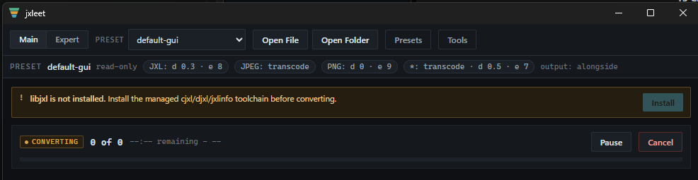
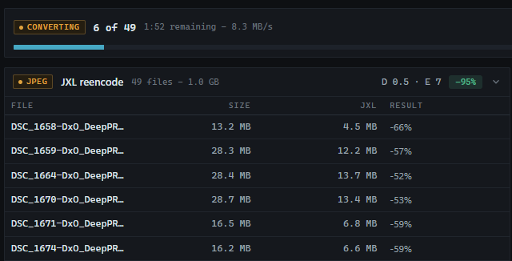
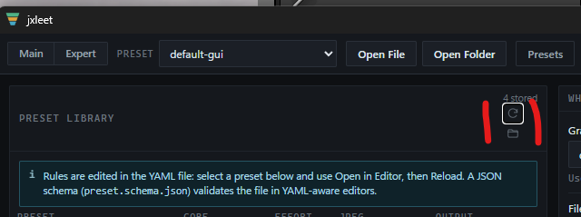
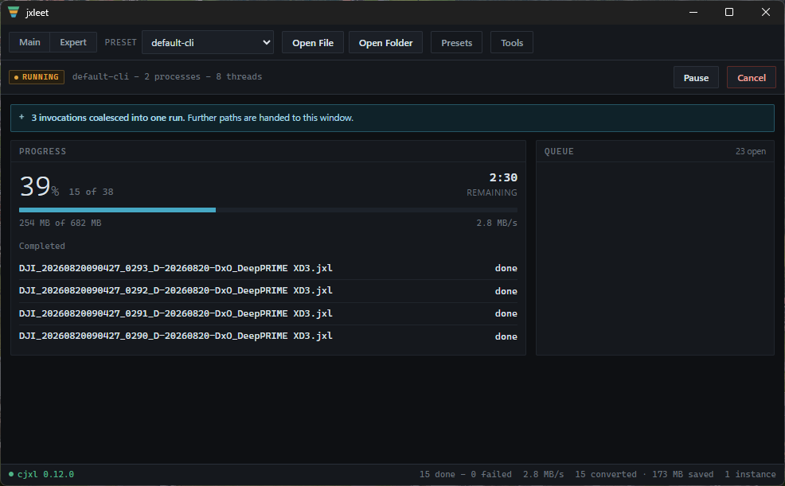

## Bugs

### GUI Mode

- [x] When starting fresh (e.g. with the script ../reset-compile-start.ps1) I will asked for installing the jxllibs, when pressing "Install" a busy state "Converting" is shown, but nothing happens until it disappears and libxl is downlaoded. Please add a proper Download status, when libxl is downloading, so the user knows that something is happening. 
- [x] When klick on the Drop Area a file open Dialog is shwoing, this is not expected. The show only be visible when the user klicks on the "Open File" or "Open Folder" buttons.
- [x] During Converting the overall number about the space which is be saved, is wring. Not already converted files are counted with zero size, which is not correct. Please only count the files which are already converted.
- [x] The space disribution of the table is not correct. The column "File" should be take a the space left over, after "Size", "JXL" and "Reslut" take their space. 
- [x] During the conversion, changes in the compressions parameters are not applied (check this!), and so the group header infomration like (D 0.5 - E 7) should not change! [Screenshot](image-2.png)
- [x] If a conversations run is done, and then one file is added, all files are converted again! Only the added file should be converted.
- [x] In the Preset View, the "Reload" and "Open" Icon-Button are above each other, they must be side by side 
- [ ] When this tool is invoked over CLI, the progress view with the completed images don't show the new size and ratio what is saved 

### CLI Mode

- [x] Added images in this mode are all queud and converted directly, at the moment I observe the following behavior: I convert 38 images with Lightroom, because of internal restriciton photoshop is calling two time this tools, one time with 20 images and one time with 18 images. The first run is working automatically, but the second run must be triggered manually.

## Feautures

- [x] Add a "Clear All" button, which removes all files.
- [x] Global Space counter, number of images converted and the space saved, should be shown in the bottom of the GUI.
- [ ] Add a new view "History" which shows all converted files with their original size, new size and the ratio what is saved. There is a clear button to remove all entries from the history. When clicked on a history entry and the file still exists, than load the "jxlinfo". As you do in the "Main"-View.
- [ ] When "output exists" then ask the user if he wants to overwrite the file or skip this file or all following files. 